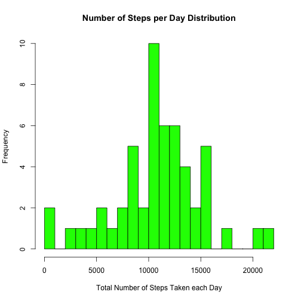
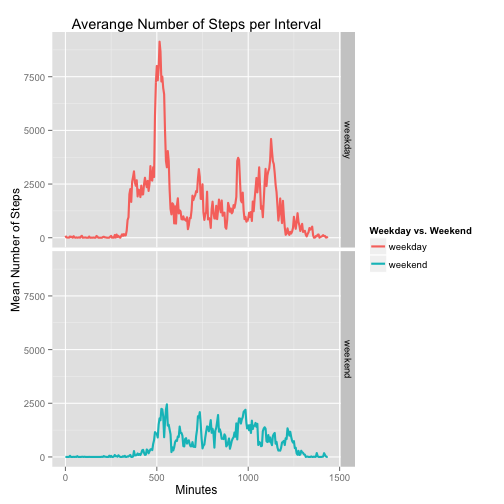

# Reproducible Research: Peer Assessment 1
==========================================

## Loading libraries

```r
library(knitr)
library(markdown)
library(ggplot2)
library(data.table)
```

## Loading and preprocessing the data

```r
options(scipen=1)
if (file.exists("processedData.RData")) {
        load("processedData.RData")
} else {
        unzip("activity.zip")
        
        DT <- data.table(fread("activity.csv")) # Faster than read.csv()
        DT[, date := as.Date(date, format = "%Y-%m-%d")] # Convert dates from class "character" to class "Date"
        DT[, interval:= rep(0:287, 61)*5] # Convert intervals to minutes
        DT[, steps:= as.numeric(steps)]
        save(DT, file = "processedData.RData")
}
```

## What is mean total number of steps taken per day?

Saving a copy of raw data and creating auxiliaty datasets

```r
DTraw <- copy(DT)
DT <- DTraw[complete.cases(DT)] # Excluding NAs values
DTsum <- DT[!is.na(DT[,steps]),sum(steps),by=date] # Total number of steps taken each day
setnames(DTsum, "V1", "steps")
DTavg <- DT[!is.na(DT[,steps]),sum(steps),by=interval] # Average number of steps taken on each 5-minute interval, averaged across all days
setnames(DTavg, "V1", "avg")
```

## What is the average daily activity pattern?

### What is mean total number of steps taken per day?
#### Make a histogram of the total number of steps taken each day

```r
hist(DTsum[, steps], 
              col    = "green",
              breaks = 25,
              main   = "Number of Steps per Day Distribution",
              xlab   = "Total Number of Steps Taken each Day",
              ylab   = "Frequency")
```

 

#### Calculate and report the mean and median total number of steps taken per day

```r
meanSteps <- round(DTsum[, mean(steps)], 1)
medianSteps <- DTsum[, median(steps)]
```

+ Mean of total number of steps taken per day: ***10766.2.***
+ Median of total number of steps taken per day: ***10765.***

### What is the average daily activity pattern?

#### Make a time series plot (i.e. type = "l") of the 5-minute interval (x-axis) and the average number of steps taken, averaged across all days (y-axis)

```r
with(DTavg,
     plot(avg ~ interval,
          type ="l",
          main = "Averange Number of Steps per Interval",
          xlab = "Minutes",
          ylab = "Mean Number of Steps"))
```

 

#### Which 5-minute interval, on average across all the days in the dataset, contains the maximum number of steps?

```r
maxID <-  DTavg[avg==max(avg)][[1]]
maxInt <- sprintf("[%.2d:%.2d - %.2d:%.2d)", maxID%/%60, maxID%%60, (maxID+5)%/%60, (maxID+5)%%60) # Convert interval value to a more intuitive format
```

+ The 5-minute interval, on average across all the days in the dataset, which contains the maximum number of steps is: ***[08:35 - 08:40).***

## Imputing missing values

```r
naDT <- copy(DT)
naDT <- naDT[is.na(naDT$steps),steps:= round(DTavg$avg, 0), by=date] # Fill NAs with the mean for that 5-minute interval
```

## Are there differences in activity patterns between weekdays and weekends?

```r
DTsumNA <- naDT[,sum(steps),by=date] # Total number of steps taken each day
setnames(DTsumNA, "V1", "steps")
meanStepsNA <- round(DTsumNA[, mean(steps)], 1)
medianStepsNA <- DTsumNA[, median(steps)]
```

+ Mean of total number of steps taken per day (NAs filled): ***10766.2.***
+ Median of total number of steps taken per day (NAs filled): ***10765.***

+ Difference of the means: ***10766.2 - 10766.2 = 0.***
+ Difference of the medians: ***10765 - 10765 = 0.***

> According to our results, **no significant diffence** from these new estimates (using the dataset with the filled-in missing values) from those of first part of the assignment were observed.  

> *Please note that in the first part of the assignment we did not take the missing values into our analysis. As it would lead us to unnecessary miscalculation.*


```r
naDT <- naDT[,weekday:=weekdays(date)]
naDT <- naDT[DT[,weekday] %in% c("Sunday", "Saturday"), weekday:= "weekend"]
naDT <- naDT[DT[,weekday]!="weekend", weekday:= "weekday"]
naDT <- naDT[,weekday:= as.factor(weekday)]
print(naDT)
```

```
##        steps       date interval weekday
##     1:     0 2012-10-02        0 weekday
##     2:     0 2012-10-02        5 weekday
##     3:     0 2012-10-02       10 weekday
##     4:     0 2012-10-02       15 weekday
##     5:     0 2012-10-02       20 weekday
##    ---                                  
## 15260:     0 2012-11-29     1415 weekday
## 15261:     0 2012-11-29     1420 weekday
## 15262:     0 2012-11-29     1425 weekday
## 15263:     0 2012-11-29     1430 weekday
## 15264:     0 2012-11-29     1435 weekday
```

#### Make a panel plot containing a time series plot (i.e. type = "l") of the 5-minute interval (x-axis) and the average number of steps taken, averaged across all weekday days or weekend days (y-axis). The plot should look something like the following, which was creating using simulated data.


```r
DTavgWeek <- naDT[,sum(steps),by=list(interval, weekday)] # Average number of steps taken on each 5-minute interval, averaged across all days
setnames(DTavgWeek, "V1", "avg")

ggplot(DTavgWeek, aes(x=interval, y=avg, colour=weekday)) +
        geom_line(size=1) +
        facet_grid(weekday~.) +
        labs(title="Averange Number of Steps per Interval") +
        labs(x="Minutes", y="Mean Number of Steps") +
        labs(colour="Weekday vs. Weekend")
```

 
